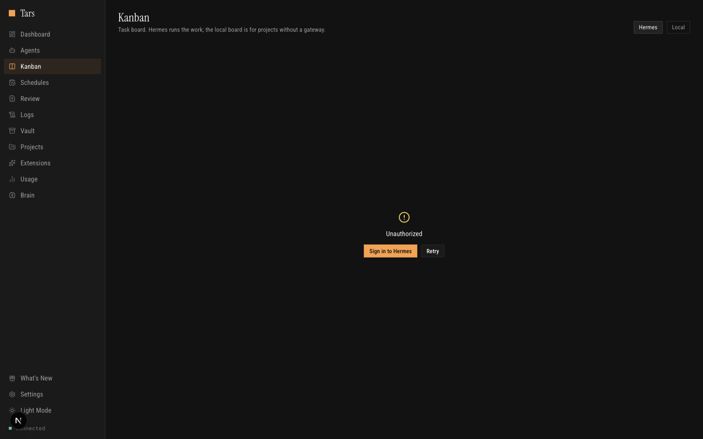
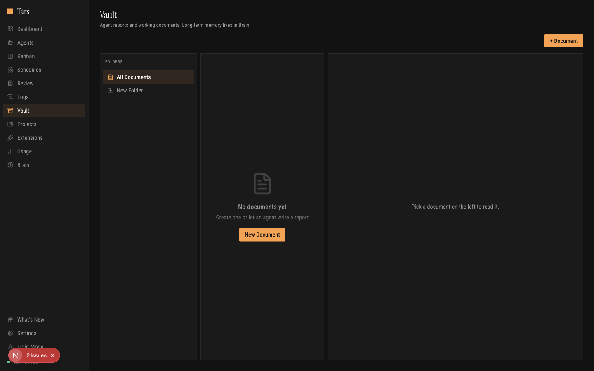

# 5 | Source | What it is | How agents reach it |
|---|---|---|
| Project memory | `~/.claude/projects/*/memory/*.md` | digest at session start, `memory_read` |
| Session observations | per-project ledger in `~/.dorothy/observations/` | digest at session start |
| Hermes memory | the gateway's own `MEMORY.md` / `USER.md`, plus full-text search over every past session | `memory_search` |
| gbrain | shared semantic memory over MCP | `memory_search` |
| Honcho | Plastic Labs' memory layer over MCP | `memory_search` |

Hermes exposes no HTTP API for memory *content* — `/api/memory` only administers
which provider is active — so the files come through `/api/files/read` and recall
through `/api/sessions/search`, which is what its own dashboard does.

Reaching all of it is provider-agnostic twice over:

- **`tars-memory`**, a bundled MCP server registered with *every* provider's own
  config (`~/.claude.json`, `~/.codex/config.toml`, `~/.gemini/settings.json`,
  `~/.grok/config.toml`, `~/.opencode/config.json`, `~/.pi/config.json`), exposing
  `memory_search`, `memory_read`, `memory_write` and `memory_sources`
- **prompt injection** for the CLIs that have no session-start hook, so they
  cannot begin blind even if they never call a tool

The Brain page contacts each source when you open it: *reachable* means something
answered, and it lists the tools each backend offers.

## Kanban Task Management

A task board integrated with the agent system. Tasks flow through columns and can be automatically assigned to agents based on skill matching.



### Workflow

```
Backlog → Planned → Ongoing → Done
```

- **Priority levels**: Low, Medium, High
- **Progress tracking**: 0-100% per task
- **Agent assignment**: Assign tasks to specific agents or let the system auto-assign
- **Labels and tags**: Organize and filter tasks
- **Skill requirements**: Define required skills — the system matches tasks to capable agents

### Automatic Agent Assignment

The `kanban-automation` service continuously watches for new tasks and:

1. Matches task skill requirements against available agents
2. Creates new agents if no matching agent exists
3. Assigns the task and moves it to `ongoing`
4. Tracks progress as the agent works
5. Marks the task `done` when the agent completes

This enables a **self-managing task pipeline** — add tasks to the backlog and agents automatically pick them up.

---

## Remote Control

### Telegram Integration

Control your entire agent fleet from Telegram. Start agents, check status, delegate tasks to the Super Agent — all from your phone.

| Command | Description |
|---------|-------------|
| `/status` | Overview of all agents and their states |
| `/agents` | Detailed agent list with current tasks |
| `/projects` | List all projects with their agents |
| `/start_agent <name> <task>` | Spawn and start an agent with a task |
| `/stop_agent <name>` | Stop a running agent |
| `/ask <message>` | Delegate a task to the Super Agent |
| `/usage` | API usage and cost statistics |
| `/help` | Command reference |

Send any message without a command to talk directly to the Super Agent.

**Media support** via the `mcp-telegram` server: send photos, videos, and documents.

**Setup:**
1. Create a bot via [@BotFather](https://t.me/botfather) and copy the token
2. Paste the bot token in **Settings**
3. Send `/start` to your bot to register your chat ID
4. Multiple users can authorize by sending `/start`

### Slack Integration

Same capabilities as Telegram, accessible via @mentions or direct messages.

| Command | Description |
|---------|-------------|
| `status` | Overview of all agents |
| `agents` | Detailed agent list |
| `projects` | List projects with agents |
| `start <name> <task>` | Spawn and start an agent |
| `stop <name>` | Stop a running agent |
| `usage` | API usage and cost statistics |
| `help` | Command reference |

**Features:** @mentions in channels, DMs, Socket Mode (no public URL), thread-aware responses.

**Setup:**
1. Go to [api.slack.com/apps](https://api.slack.com/apps) → **Create New App** → **From scratch**
2. Name it "Tars" and select your workspace
3. **Socket Mode** → Enable → Generate App Token with scope `connections:write` (`xapp-...`)
4. **OAuth & Permissions** → Add scopes: `app_mentions:read`, `chat:write`, `im:history`, `im:read`, `im:write`
5. **Install to Workspace** → Copy Bot Token (`xoxb-...`)
6. **Event Subscriptions** → Enable → Subscribe to: `app_mention`, `message.im`
7. **App Home** → Enable "Messages Tab"
8. Paste both tokens in **Settings → Slack** and enable

---

## Vault

A persistent document storage system that agents can read, write, and search across sessions. Use it as a shared knowledge base — agents store reports, analyses, research findings, and structured notes that any other agent can access later.



### Features

- **Markdown documents** with title, content, tags, and file attachments
- **Folder organization** with nested hierarchies (auto-created on document creation)
- **Full-text search** powered by SQLite FTS5 — search across titles, content, and tags
- **Cross-agent access** — any agent can read documents created by another
- **File attachments** — attach files to documents for reference

### MCP Tools

| Tool | Parameters | Description |
|------|-----------|-------------|
| `vault_create_document` | `title`, `content`, `folder`, `tags?` | Create a document (auto-creates folder if needed) |
| `vault_update_document` | `document_id`, `title?`, `content?`, `tags?`, `folder_id?` | Update an existing document |
| `vault_get_document` | `document_id` | Read a document with full content and metadata |
| `vault_list_documents` | `folder_id?`, `tags?` | List documents, optionally filtered by folder or tags |
| `vault_delete_document` | `document_id` | Delete a document |
| `vault_attach_file` | `document_id`, `file_path` | Attach a file to a document |
| `vault_search` | `query`, `limit?` | Full-text search (supports AND, OR, NOT, phrase matching) |
| `vault_create_folder` | `name`, `parent_id?` | Create a folder (supports nesting) |
| `vault_list_folders` | — | List all folders as a tree |
| `vault_delete_folder` | `folder_id`, `recursive?` | Delete a folder (optionally with all contents) |

---

## SocialData (Twitter/X)

Search tweets, get user profiles, and retrieve engagement data via the [SocialData API](https://socialdata.tools). Useful for social media research, monitoring, and analysis tasks.

### Setup

1. Get an API key from [socialdata.tools](https://socialdata.tools)
2. Paste it in **Settings → SocialData API Key**

### MCP Tools

| Tool | Parameters | Description |
|------|-----------|-------------|
| `twitter_search` | `query`, `type?`, `cursor?` | Search tweets with advanced operators (`from:`, `min_faves:`, `filter:images`, etc.) |
| `twitter_get_tweet` | `tweet_id` | Get full tweet details with engagement metrics |
| `twitter_get_tweet_comments` | `tweet_id`, `cursor?` | Get replies/comments on a tweet |
| `twitter_get_user` | `username` | Get a user's profile (bio, followers, stats) |
| `twitter_get_user_tweets` | `user_id`, `include_replies?`, `cursor?` | Get recent tweets from a user |

All tools support cursor-based pagination for large result sets.

---

## Google Workspace

Access Gmail, Drive, Sheets, Docs, Calendar, and more directly from your agents via the [Google Workspace CLI](https://github.com/googleworkspace/cli) (`gws`). Tars integrates `gws` as an MCP server so agents can read emails, manage files, create documents, and interact with Google APIs.

### Setup

1. Install **gcloud CLI** — required for OAuth setup (`brew install google-cloud-sdk`)
2. Install **gws CLI** — `npm install -g @googleworkspace/cli`
3. Open **Settings → Google Workspace** and follow the guided setup:
   - Click **Auth Setup** to create a Google Cloud project and OAuth client
   - Click **Auth Login** to authenticate with your Google account
   - Enable the toggle to register the MCP server with your agents
4. Optionally install **Agent Skills** for 100+ specialized Google Workspace skills

### Features

- **MCP server**: Runs `gws mcp` over stdio, exposing Google APIs as tools (10-80 tools per service)
- **Multi-provider**: MCP server registered with all configured providers (Claude, Codex, Gemini, Grok)
- **Service badges**: Settings page shows connected services with per-service access levels (READ / R/W)
- **Agent skills**: Detects and lists installed `gws-*` skills (e.g., `gws-gmail`, `gws-drive`, `gws-calendar`)
- **Update Access**: Re-run `gws auth login` to add or change OAuth scopes without re-running setup

### Default Services

| Service | Scope | Description |
|---------|-------|-------------|
| **Gmail** | Read/Write | Send, read, and manage email |
| **Drive** | Read/Write | Manage files, folders, and shared drives |
| **Sheets** | Read/Write | Read and write spreadsheets |
| **Calendar** | Read/Write | Manage calendars and events |
| **Docs** | Read/Write | Read and write documents |

Additional services (Slides, Tasks, Chat, People, Forms, Keep) are available based on OAuth scopes.

---

## MCP Servers & Tools

Tars bundles **seven MCP servers**. They are registered automatically with every
provider Tars can run, not only with Claude Code, so an agent on Codex or Gemini
gets the same toolbelt.

### mcp-orchestrator

The main orchestration server — agent management and messaging.

#### Agent Management Tools

| Tool | Parameters | Description |
|------|-----------|-------------|
| `list_agents` | — | List all agents with status, ID, name, project, and current task |
| `get_agent` | `id` | Get detailed info about a specific agent including output history |
| `get_agent_output` | `id`, `lines?` (default: 100) | Read an agent's recent terminal output |
| `create_agent` | `projectPath`, `name?`, `skills?`, `character?`, `skipPermissions?` (default: true), `secondaryProjectPath?` | Create a new agent in idle state |
| `start_agent` | `id`, `prompt`, `model?` | Start an agent with a task (or send message if already running) |
| `send_message` | `id`, `message` | Send input to a running agent (auto-starts idle agents) |
| `stop_agent` | `id` | Terminate a running agent (returns to idle) |
| `remove_agent` | `id` | Permanently delete an agent |
| `wait_for_agent` | `id`, `timeoutSeconds?` (300), `pollIntervalSeconds?` (5) | Poll agent until completion, error, or waiting state |

#### Messaging Tools

| Tool | Parameters | Description |
|------|-----------|-------------|
| `send_telegram` | `message` | Send a text message to Telegram (truncates at 4096 chars) |
| `send_slack` | `message` | Send a text message to Slack (truncates at 4000 chars) |

### mcp-telegram

Standalone MCP server for Telegram messaging with media support.

| Tool | Parameters | Description |
|------|-----------|-------------|
| `send_telegram` | `message`, `chat_id?` | Send a text message |
| `send_telegram_photo` | `photo_path`, `chat_id?`, `caption?` | Send a photo/image |
| `send_telegram_video` | `video_path`, `chat_id?`, `caption?` | Send a video |
| `send_telegram_document` | `document_path`, `chat_id?`, `caption?` | Send a document/file |

Direct HTTPS API calls. File uploads via multipart form data. Markdown formatting support.

---

### mcp-kanban

MCP server for programmatic Kanban task management.

| Tool | Parameters | Description |
|------|-----------|-------------|
| `list_tasks` | `column?`, `assigned_to_me?` | List tasks, filter by column or assignment |
| `get_task` | `task_id` (prefix matching) | Get full task details |
| `create_task` | `title`, `description`, `project_path?`, `priority?`, `labels?` | Create a task in backlog |
| `move_task` | `task_id`, `column` | Move task between columns |
| `update_task_progress` | `task_id`, `progress` (0-100) | Update progress |
| `mark_task_done` | `task_id`, `summary` | Complete a task with summary |
| `assign_task` | `task_id`, `agent_id?` | Assign task to an agent |
| `delete_task` | `task_id` | Remove a task |

**Columns:** `backlog` → `planned` → `ongoing` → `done`

---

### mcp-vault

MCP server for persistent document management. See [Vault](#vault) for full tool reference.

---

### mcp-socialdata

MCP server for Twitter/X data via the SocialData API. See [SocialData (Twitter/X)](#socialdata-twitterx) for full tool reference.

---

## Installation

### Prerequisites

- **Node.js** 18+
- **npm** or yarn
- **Claude Code CLI**: `npm install -g @anthropic-ai/claude-code`
- **GitHub CLI** (`gh`) — used by agents for GitHub operations

### Download

Download the latest release from [GitHub Releases](https://github.com/Charlie85270/Tars/releases).

> **macOS:** If "app is damaged", run `xattr -cr /Applications/Tars.app`

### Build from Source

```bash
git clone https://github.com/Charlie85270/Tars.git
cd Tars/app/tars
npm install
npx @electron/rebuild        # Rebuild native modules for Electron
npm run electron:dev          # Development mode
npm run electron:build        # Production build (DMG)
```

Output in `release/`:
- **macOS**: `release/mac-arm64/Tars.app` (Apple Silicon) or `release/mac/Tars.app` (Intel)
- DMG installer included

### Web Browser (Development)

```bash
npm install
npm run dev
```

Open [http://localhost:3000](http://localhost:3000). Agent management and terminal features require the Electron app.

---

## Architecture

### System Overview

```
┌──────────────────────────────────────────────────────────┐
│                     Electron App                          │
│                                                           │
│  ┌───────────────────┐  ┌──────────────────────────────┐ │
│  │  React / Next.js   │  │   Electron Main Process      │ │
│  │  (Renderer)        │←→│                               │ │
│  │                    │  │  ┌──────────────────────────┐ │ │
│  │  - Agent Dashboard │  │  │  Agent Manager           │ │ │
│  │  - Kanban Board    │  │  │  (node-pty, N parallel)  │ │ │
│  │  - Brain (memory)  │  │  ├──────────────────────────┤ │ │
│  │  - Extensions      │  │  │  PTY Manager             │ │ │
│  │  - Usage Stats     │  │  │  (terminal multiplexing) │ │ │
│  │  - Skills/Plugins  │  │  ├──────────────────────────┤ │ │
│  │  - Settings        │  │  │  Services:               │ │ │
│  │                    │  │  │  - Telegram Bot           │ │ │
│  └───────────────────┘  │  │  - Slack Bot              │ │ │
│          ↕ IPC           │  │  - Kanban Automation      │ │ │
│  ┌───────────────────┐  │  │  - MCP Server Launcher    │ │ │
│  │  API Routes        │  │  │  - API Server             │ │ │
│  │  (Next.js)         │←→│  └──────────────────────────┘ │ │
│  └───────────────────┘  └──────────────────────────────┘ │
└──────────────────────────────────────────────────────────┘
           ↕ stdio                     ↕ stdio
┌──────────────────┐ ┌──────────────┐ ┌──────────────┐
│ mcp-orchestrator │ │ mcp-telegram │ │  mcp-kanban  │
│   (26+ tools)    │ │  (4 tools)   │ │  (8 tools)   │
└──────────────────┘ └──────────────┘ └──────────────┘
┌──────────────────┐ ┌──────────────┐
│    mcp-vault     │ │mcp-socialdata│
│   (10 tools)     │ │  (5 tools)   │
└──────────────────┘ └──────────────┘
```

### Data Flow: Parallel Agent Execution

1. User (or Super Agent) creates agent → API route → Agent Manager
2. Agent Manager spawns `claude` CLI process via node-pty (one per agent)
3. Multiple agents run concurrently, each in an isolated PTY session
4. Output streamed in real-time to the renderer via IPC
5. Status detected by parsing output patterns (running/waiting/completed/error)
6. Services notified (Telegram, Slack, Kanban) on status changes
7. Agent state persisted to `~/.dorothy/agents.json`

### MCP Communication

All MCP servers communicate via **stdio** (standard input/output):

```
Claude Code ←→ stdio ←→ MCP Server
                         ├── Tool handlers (Zod-validated schemas)
                         └── @modelcontextprotocol/sdk
```

---

## Project Structure

```
tars/
├── src/                           # Next.js frontend (React)
│   ├── app/                       # Page routes
│   │   ├── agents/                # Agent management UI (+ templates, teams)
│   │   ├── kanban/                # Kanban board UI
│   │   ├── settings/              # Settings page
│   │   ├── skills/                # Extensions (skills + plugins)
│   │   ├── usage/                 # Usage statistics
│   │   ├── projects/              # Projects overview
│   │   └── api/                   # Backend API routes
│   ├── components/                # React components
│   ├── hooks/                     # Custom React hooks
│   ├── lib/                       # Utility functions
│   ├── store/                     # Zustand state management
│   └── types/                     # TypeScript type definitions
├── electron/                      # Electron main process
│   ├── main.ts                    # Entry point
│   ├── preload.ts                 # Preload script
│   ├── core/
│   │   ├── agent-manager.ts       # Agent lifecycle & parallel execution
│   │   ├── pty-manager.ts         # Terminal session multiplexing
│   │   └── window-manager.ts      # Window management
│   ├── services/
│   │   ├── telegram-bot.ts        # Telegram bot integration
│   │   ├── slack-bot.ts           # Slack bot integration
│   │   ├── api-server.ts          # HTTP API server
│   │   ├── mcp-orchestrator.ts    # MCP server launcher
│   │   ├── claude-service.ts      # Claude Code CLI integration
│   │   ├── hooks-manager.ts       # Git hooks management
│   │   └── kanban-automation.ts   # Task → Agent auto-assignment
│   ├── handlers/                  # IPC handlers
│   │   ├── ipc-handlers.ts       # Agent, skill, plugin IPC
│   │   └── gws-handlers.ts       # Google Workspace integration
├── mcp-orchestrator/              # MCP server (orchestration)
│   └── src/tools/
│       ├── agents.ts              # Agent management tools
│       └── messaging.ts           # Telegram/Slack tools
├── mcp-memory/                    # MCP server (the five memory sources)
│   └── src/index.ts               # search, read, write, sources
├── mcp-telegram/                  # MCP server (Telegram media)
│   └── src/index.ts               # Text, photo, video, document
├── mcp-kanban/                    # MCP server (task management)
│   └── src/index.ts               # Kanban CRUD tools
├── mcp-vault/                     # MCP server (document management)
│   └── src/index.ts               # Vault CRUD + search tools
├── mcp-socialdata/                # MCP server (Twitter/X data)
│   └── src/index.ts               # Twitter search + user tools
├── mcp-x/                         # MCP server (posting to X)
│   └── src/index.ts               # post, reply, delete
└── landing/                       # Marketing landing page
```

---

## Tech Stack

| Category | Technology | Version |
|----------|-----------|---------|
| **Framework** | Next.js (App Router) | 16 |
| **Frontend** | React | 19 |
| **Desktop** | Electron | 43 |
| **Styling** | Tailwind CSS | 4 |
| **State** | Zustand | 5 |
| **Animations** | Framer Motion | 12 |
| **Terminal** | xterm.js + node-pty | 5 / 1.1 |
| **Database** | better-sqlite3 | 13 |
| **MCP** | @modelcontextprotocol/sdk | 1.0 |
| **Telegram** | node-telegram-bot-api | 0.67 |
| **Slack** | @slack/bolt | 4.0 |
| **Validation** | Zod | 3.22 |
| **Language** | TypeScript | 5 |

---

## Configuration & Storage

### Configuration Files

| File | Description |
|------|-------------|
| `~/.dorothy/app-settings.json` | App settings (Telegram token, Slack tokens, preferences) |
| `~/.dorothy/cli-paths.json` | CLI tool paths for agents |
| `~/.claude/settings.json` | Claude Code user settings |

### Data Files

| File | Description |
|------|-------------|
| `~/.dorothy/agents.json` | Persisted agents. Versioned, written atomically through a temp file and rename; a corrupt copy is kept as `.corrupt` rather than replaced |
| `~/.dorothy/agents.backup.json` | Last copy that parsed successfully |
| `~/.dorothy/projects.json` | Folders you added, so an update never loses them |
| `~/.dorothy/kanban-tasks.json` | Local kanban board (the Hermes board lives in the gateway) |
| `~/.dorothy/team-templates.json` | Team templates |
| `~/.dorothy/observations/` | Per-project activity ledgers |
| `~/.dorothy/usage-ledger.jsonl` | Per-turn tokens and cost, for the CLIs that write no transcript |
| `~/.dorothy/model-catalog.json` | Cached model + price catalogue, with its ETag |
| `~/.dorothy/acp-registry.json` | Cached ACP launch commands |
| `~/.dorothy/hermes-connection.json` | Gateway mode, URL and token |
| `~/.dorothy/vault.db` | Vault documents, folders and FTS index (SQLite) |

### Generated Files

| Location | Description |
|----------|-------------|
| `~/.dorothy/scripts/` | Generated task runner scripts |
| `~/.claude/logs/` | Task execution logs |

---

## Development

### Scripts

```bash
npm run dev              # Next.js dev server
npm run electron:dev     # Electron + Next.js concurrent dev mode
npm run build            # Next.js production build
npm run electron:build   # Distributable app (DMG)
npm run electron:pack    # Directory package, for testing a real build
npm run sandbox          # A second instance with its own HOME, beside your real one
npm run lint             # ESLint
npm run lint:design      # Design guardrails (radius, shadows, gradients, palette)
npm run e2e              # Playwright drives the real Electron app, 35 surfaces
npm run e2e:update       # Re-record the visual baselines
npm run e2e:guard        # Fail if a surface in design/UI-INVENTORY.md is uncovered
```

### Build Pipeline

1. Next.js production build (API routes moved aside — the packaged app has no server)
2. TypeScript compilation for the Electron main process
3. The seven MCP servers built independently and copied into `extraResources`
4. `electron-builder` packages into a distributable

### Design

`design/tars.pen` holds every surface as a Pencil frame — pages, all seventeen
settings sections, overlays, menus, control states, the launch sequence and the
loading stages. `design/UI-INVENTORY.md` is the checklist the E2E guard reads.

### Environment

The app reads Claude Code configuration from:
- `~/.claude/settings.json` — User settings
- `~/.claude/statsig_metadata.json` — Usage statistics
- `~/.claude/projects/` — Project-specific data

---

## Contributing

Contributions are welcome. Please submit a Pull Request.

1. Fork the repository
2. Create your feature branch (`git checkout -b feature/my-feature`)
3. Commit your changes
4. Push to the branch
5. Open a Pull Request

## License

This project is open source and available under the [MIT License](LICENSE).

## Acknowledgments

- [Anthropic](https://anthropic.com) for Claude Code
- [skills.sh](https://skills.sh) for the skills ecosystem
